  

## `$ cat sobre-mim.md`

Desenvolvedor **Full Stack** com alma de **DevOps** — do backend em **Java/Quarkus** e **Go**
ao mobile com **Flutter**, gosto de construir as coisas de ponta a ponta (e de automatizar
o caminho inteiro).

- 🌱 Sempre aprendendo alguma coisa nova (a lista muda toda semana)

## `$ ls stack/`

  
  
  
  
  
  
  
  
  

## `$ ./stats --daily`

  <picture>
    <source media="(prefers-color-scheme: dark)" srcset="https://raw.githubusercontent.com/MiguelFernandesSantos/MiguelFernandesSantos/output/github-snake-dark.svg">
    
  </picture>

  

## `$ ./contato --all`

